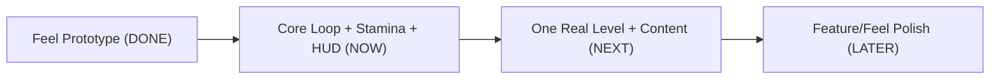

# Vertical Slice Roadmap

## Where you are: end of the "Feel Prototype" phase

Your project has an unusually strong foundation for its stage. What's done is the *hard* part most prototypes never nail:

- **Movement**: walk/jog/sprint (burst+sustain), jump, double jump, wall cling/slide/jump, dash with i-frames, coyote/buffer, momentum, nail pogo (`scripts/scr_player_movement/scr_player_movement.gml`, `objects/obj_player/Create_0.gml`).
- **Combat**: 2-hit combo w/ finisher, hitstop, knockback, armor/trade rules, dodge-cancel (`scripts/scr_player_attack/scr_player_attack.gml`, `scripts/scr_enemy_ai/scr_enemy_ai.gml`).
- **Juice/visuals**: hit-slash FX, particles, screen distortion, enemy death shatter, Bulb lighting + bloom + vignette + fog + dust + drips.
- **Audio**: footsteps, clanks, drips, shatter with cave reverb buses.

But it is **not yet a playable game loop**. The blocking gaps:

- `obj_player_health` decrements but nothing checks `<= 0` -> you can't die from combat (`objects/obj_player/Collision_obj_enemy_parent.gml`, `scripts/scr_enemy_ai/scr_enemy_ai.gml`).
- No HUD at all (no Draw GUI events anywhere; `display_set_gui_size` is set but unused).
- No stamina system (your chosen pillar) — no variable exists.
- No game-state manager, pause, title, or game-over.
- One playable room (`room_test`), one enemy type (`obj_enemy`, ground only), no hazards placed, respawn hardcoded to `(160,640)` in `objects/obj_player/Alarm_0.gml`.
- No fonts on disk (needed for UI).

## Answer: what to prioritize now

For a **polished demo**, content and new animations come *after* the loop is closed. Prioritize in this order:

### Phase 1 - Close the core loop + Stamina pillar + HUD (do this now)
This is what turns the prototype into a playable demo. **Polish-first standard** (per your preference): each item ships with animation and transitions, not just working logic.

- **Death sequence (polished)**: `obj_player_health <= 0` -> play **hurt** then **death** animation -> **screen fade-out** -> respawn at checkpoint -> **fade-in**. Reuses the `is_dying`/`Alarm_0` timing but adds a fader object + two new player sprites (`spr_mc_hurt`, `spr_mc_death` — your art) and likely a death SFX.
- **Stamina system (pillar)**: `player_stamina`/`player_stamina_max`, drain on dash and attack, delayed regen, and *gate* those abilities when empty (hook `scr_player_sprint_try_begin` / `scr_player_try_attack_start`). Comes with a **smoothly animated depleting bar** and low/empty feedback (color shift, shake, or dim on failed action).
- **Themed HUD** (`obj_hud`, Draw GUI): health + stamina bars styled to the crystal-cave look, with **animated fills** (smooth drain, chip/flash on damage). Needs a font asset (none exist yet) and bar art (found or authored).
- **Game-state + pause**: `global.game_state` (playing/paused/dead); pause **dims/blurs** the scene behind a **styled pause menu**; add a **game-over screen** on death-with-no-lives (or straight respawn if unlimited).
- **Title screen**: a styled `room_title` that boots first, with an animated Start prompt.

Note: the code for all of this is quick; the calendar cost is the **art + transitions** (hurt/death frames, bar art, menu layout). Those are your bottleneck, not the wiring.

### Phase 2 - Build the vertical slice level (next)
- One hand-crafted level with intro -> challenge -> climax pacing (extend `room_test` or a fresh room).
- **Checkpoints** replacing the hardcoded respawn point.
- Place **hazards** (add a spike child of `obj_hazard_parent`; framework already exists).
- **1 new enemy variant** for variety — an **air/flying enemy** is the biggest gap (only ground AI exists; `scr_enemy_floating_hover` is visual-only today).

### Phase 3 - Feature/feel polish (later, only if slice feels complete)
- **Air attack** + **3rd combo hit** — hooks already partially exist (dead `case 3:` in `scr_player_attack.gml`; attack gated to grounded).
- Movement **SFX**: jump/dash/whoosh + dedicated land clip; per-room **music** (6 of 7 tracks imported but unused).

## Revised timeline (polish-first)

Because you want everything polished (hurt/death anim + fade-in respawn, real animated stamina bar, styled menus), the estimate shifts from "code time" to "art + iteration time." Code stays fast; art/animation/level iteration dominate.

- **Phase 1 (loop + stamina + HUD, polished)**: code ~2-4 sessions, but with hurt/death animation, themed animated bars, styled pause/title -> **~1-2 weeks calendar** including your art.
- **Phase 2 (vertical slice level + air enemy + hazards)**: **~2-4 weeks**, dominated by level iteration and a fully-animated new enemy.
- **Phase 3 (air attack, 3rd combo, movement/whoosh SFX, music)**: code ~1 week, plus new attack animations -> **~1-2 weeks** at your polish bar.

**Bottom line at a polished bar: ~5-8 weeks calendar** for the full vertical slice, assuming steady part-time work. If I implement all code and you focus purely on art/level design, the code is never the blocker.

Recommended way to work it: build Phase 1 in **independently shippable slices** (e.g., death+fade first so you have a real fail-state to feel, then stamina+bar, then title/pause) so you can playtest polish as you go rather than at the end.

## Art dependencies you own (the real bottleneck)
- `spr_mc_hurt`, `spr_mc_death` (Phase 1 death sequence)
- Health + stamina bar art / frame (Phase 1 HUD) - can start with a clean procedural bar and reskin later
- Title + pause menu backdrop/layout (Phase 1)
- Flying enemy full animation set (Phase 2)
- Air attack + 3rd-hit attack animations (Phase 3)

## Decisions to confirm before building
- Respawn model: unlimited retries at checkpoint, or lives + game-over screen?
- Can I start Phase 1 wiring with **placeholder art** (procedural bars, a simple fade, reuse an existing frame for hurt) so gameplay is testable immediately, and you swap in final art later? Or wait until you have the art in hand?
- Stamina defaults (max, cost per dash/attack, regen rate/delay) - I'll propose tunable values.